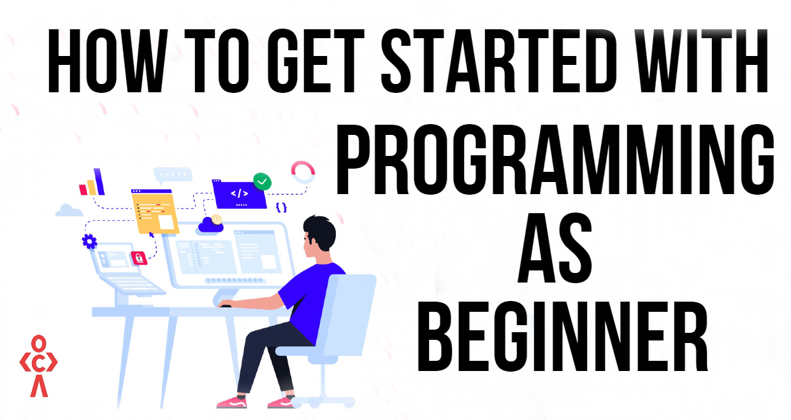

# Welcome to my Journey of becoming a Fullstack Developer

## About Me 👋

Hi there! Welcome to my developer journey. Whether you're a beginner like me or a seasoned professional, I hope my path inspires and resonates with you.

I'm an aspiring developer passionate about building things with code. My journey started with mastering HTML5 and CSS. I've dabbled in SASS/SCSS, but I haven't had the chance to explore Tailwind CSS yet—it's on my list for the future!

Beyond coding, I’m captivated by the world of art, 3D design, and animations. The way creativity brings imagination to life—whether through a stunning visual, a fluid animation, or immersive 3D models—truly amazes me. These fields remind me of the endless possibilities of blending technology with art, and I hope to explore them more deeply in the future.

---

## 2025: A Year of Learning 🚀

This year, I've set an ambitious goal to dedicate 300 days to learning and growing as a developer. My focus is on mastering the following technologies:

JavaScript: The foundation of web development.

Git: Version control is key to collaborating and maintaining projects.

React.js: A powerful library for building interactive UIs.

TypeScript: Bringing type safety and better tooling to JavaScript.

Node.js: Enabling full-stack JavaScript development with server-side skills.

---

## My Learning Plan 📚

I've structured my journey into manageable phases:

1. JavaScript and Git: Day 1 - 60

Laying the groundwork with the essentials.

Hands-on practice with JavaScript basics and version control workflows.

2. React.js: Day 61 - 120

Diving into React to create dynamic and responsive web applications.

3. TypeScript: Day 121 - 150

Enhancing JavaScript skills by learning to write clean, type-safe code.

4. Node.js: Day 151 - 210

Exploring backend development and building APIs.

5. Project Development: Day 211 - 300

Applying everything I've learned to build real-world projects.

---

## Why I'm Sharing This 🌟

I believe in the power of community and sharing knowledge. Documenting my journey is a way to:

Stay accountable to my goals.

Connect with other developers and learn from their experiences.

Inspire others who are just starting out in tech.

---

## Let's Connect 🤝

I'm always eager to connect with other developers, share tips, or collaborate on projects. If you're on a similar journey or have advice, feel free to reach out!

Happy coding!
